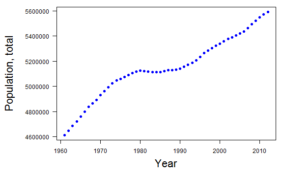

About our World  
========================================================
author: amb54
date: January 25, 2015
transition: rotate
  
<small>
Course Project: Developing Data Products  
</small>


Learn more
========================================================
transition: rotate

...about our world and get to know your country, an important part of the world.  
<br>
Open data gotten from the World Bank show how different countries as well as the whole world have developed from 1961 up to recent years.  
<br>
The World Bank gathers data for each country in topics such as:   
<small>
Agriculture & Rural Development, Aid Effectiveness, Climate Change, Economy & Growth, Education, Energy & Mining, Environment, External Debt, Financial Sector, Gender, Health, Infrastructure, Poverty, Private Sector, Public Sector, Science & Technology, Social Development, Social Protection & Labor, Trade, Urban Development   </small>

Indicators
========================================================
 
Each topic have up to forty different indicators. The app include a few of those, primarily from the topics <b>Infrastructure</b> and <b>Health</b>.  
<small>(The links below leads to the rawdata on the World Bank website.)</small>  
<br>
<small>
[Population, total](http://data.worldbank.org/indicator/SP.POP.TOTL )   
[Arable land (hectares per person) ](http://data.worldbank.org/indicator/AG.LND.ARBL.HA.PC)  
[GNI per capita based on purchasing power parity (PPP)] (http://data.worldbank.org/indicator/NY.GNP.PCAP.PP.CD)  
[Improved water source, rural (% of rural population with access)] (http://data.worldbank.org/indicator/SH.H2O.SAFE.RU.ZS)  
[Improved water source, urban (% of urban population with access)](http://data.worldbank.org/indicator/SH.H2O.SAFE.UR.ZS)  
[Access to electricity (% of population)](http://data.worldbank.org/indicator/EG.ELC.ACCS.ZS)  
[Internet users (per 100 people)](http://data.worldbank.org/indicator/IT.NET.USER.P2)  
[Motor vehicles (per 1,000 people)](http://data.worldbank.org/indicator/IS.VEH.NVEH.P3)  
[Fertility rate, total (births per woman)](http://data.worldbank.org/indicator/SP.DYN.TFRT.IN)  
[Mortality rate, under-5 (per 1,000 live births)](http://data.worldbank.org/indicator/SH.DYN.MORT)
</small>


Example
========================================================

This is how data of Denmarks total population from 1961 to 2012 looks like in the app
<small>

```r
par(mar = c(5.1, 8, 1, 1)); plot(plotData0, pch=20, ylab="",xlab="Year",cex = 1.5, col="blue", las=1,cex.lab=1.8); mtext(totalPop, side = 2, line = 6, cex=1.8)
```

 
</small>  


Go to...
========================================================
[About our World](https://amb54.shinyapps.io/ProjDataProdDev/) and learn more!  
 
Data used in this app is downloaded from  
[World Bank Open Data] ( http://data.worldbank.org/ ).  

My hope is that anyone using this app will get even more curious about The World Bank Group, and their work to end extreme poverty and promote shared prosperity.  
<br>
<br>
<br>
Thank you!
